# TOTP密码管理器


一个用 Python 写的 TOTP（基于时间的一次性密码）管理器，界面简洁，数据加密存储。如果你受够了手机上的验证码应用，或者想要一个本地化的 TOTP 管理方案，这个工具可能适合你。

## 主要功能

- **加密存储**：用主密码 AES 加密保存 TOTP 密钥，本地文件不存明文
- **实时更新**：自动刷新 6 位验证码，显示剩余时间进度条
- **简洁界面**：PySide6 写的 GUI，支持搜索、排序、大号显示
- **密码强度检查**：设密码时会提示强度，建议至少 8 位
- **自动格式化**：输入 TOTP 密钥时自动加空格，方便核对

## 项目结构

```
py-totp-new/
├── main.py                 # 程序入口
├── requirements.txt        # 依赖列表
├── README.md              # 说明文档
└── src/                   # 源码目录
    ├── core/              # 核心逻辑
    │   ├── encryption.py  # 加密相关
    │   └── totp_manager.py # TOTP 管理
    ├── ui/                # 界面部分
    │   ├── main_window.py # 主窗口
    │   ├── password_dialog.py # 密码弹窗
    │   └── add_entry_dialog.py # 添加条目弹窗
    └── utils/             # 工具类
        └── config.py      # 配置管理
```

## 快速开始

### 1. 安装依赖

```bash
pip install -r requirements.txt
```

### 2. 运行

```bash
python main.py
```

### 3. 首次使用

第一次运行会让你设置一个主密码，记住它，以后每次启动都要输入这个密码来解密数据。

### 4. 添加 TOTP 条目

1. 点工具栏的"➕ 添加"按钮
2. 填名称（比如"GitHub"）
3. 填 TOTP 密钥（就是那串 base32 字符，输入时会自动格式化）
4. 发行者可选（比如"GitHub"）
5. 确定保存

### 5. 使用验证码

- 左边列表显示所有条目，实时刷新 6 位码和剩余时间
- 点某个条目，右边会显示大号的验证码，方便临时抄录
- 30 秒自动刷新一次，进度条直观显示剩余时间

## 技术细节

### 加密方式

- 用 PBKDF2 从主密码派生密钥
- AES 加密每个 TOTP 密钥，每个条目有独立盐值
- 配置文件里只存加密后的数据

### 界面框架

- PySide6 写的，现代扁平风格
- 响应式布局，窗口可调大小
- 深色主题（系统跟随）

### 依赖库

- **PySide6**：界面框架
- **pyotp**：生成 TOTP 验证码
- **cryptography**：处理加密解密

## 开发相关

代码尽量写了类型注解，结构也比较清晰，核心模块分工明确：

- `TOTPApp` - 应用主类，负责初始化
- `EncryptionManager` - 加密解密
- `TOTPManager` - 管理 TOTP 条目
- `ConfigManager` - 读写配置
- `MainWindow` - 主界面
- `PasswordDialog` - 密码弹窗
- `AddEntryDialog` - 添加条目弹窗

## 运行流程图



## 许可证

GNU General Public License v3.0。简单说就是你可以用、可以改、可以分发，但如果你在商业项目或公开产品里用了这个代码，**希望你能在合适的地方提一下原作者**，比如：

> 原作者：ant-cave (https://github.com/ant-cave)
<br>项目地址：(https://github.com/ant-cave/py-totp-new)

这不是法律强制要求，但能帮我们持续维护，也让更多开发者愿意参与开源。

## 贡献

欢迎提 Issue 或 PR